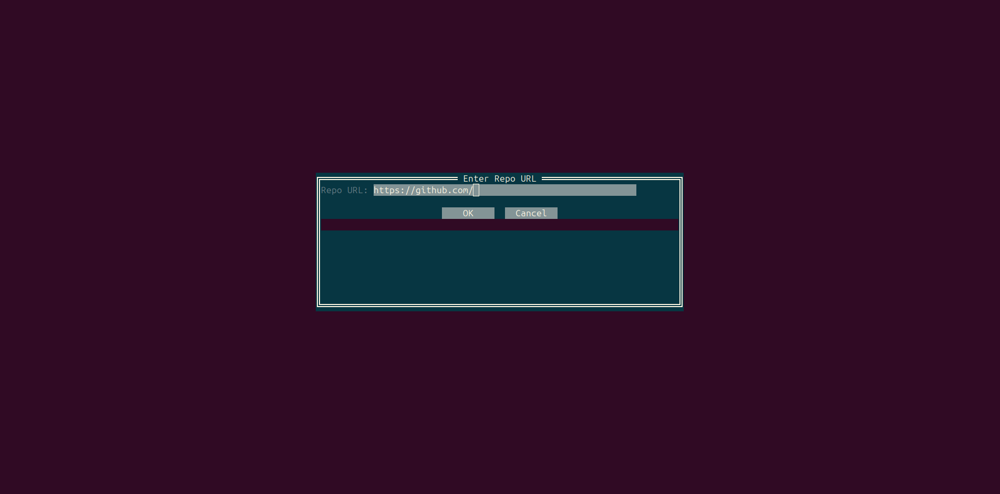
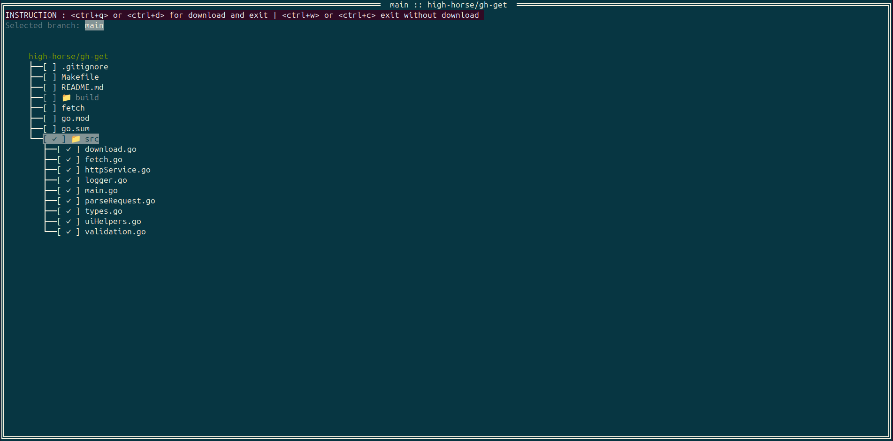

# gh-get


`gh-get` is a simple command-line tool written in Go to fetch and download GitHub repositories or releases quickly. Perfect for developers who want a lightweight, no-frills way to retrieve repo assets without cloning or navigating GitHub’s web interface.

# Example README Section

Here’s a screenshot of the app in action:



Another example of the main screen:



## Features

- Download the latest release or a specific tag from a GitHub repository.
- Optional cloning of a repository.
- Lightweight and fast Go binary, no extra dependencies.
- Cross-platform support (Linux, macOS, Windows).

## Installation

### Download Prebuilt Binary

1. Go to the [repo](https://github.com/high-horse/gh-get).
2. Download the appropriate binary for your OS (`gh-get-linux`, `gh-get-darwin`, `gh-get-windows.exe`).
3. Make it executable (Linux/macOS):
    ```bash
    chmod +x gh-get
    ```
4. Move it to a folder in your `PATH`:
    ```bash
    mv gh-get /usr/local/bin/
    ```

### Build from Source

You need [Go](https://golang.org/dl/) installed.

```bash
git clone https://github.com/high-horse/gh-get.git
cd gh-get
go build -o gh-get
```
Then move the binary to a folder in your PATH as shown above.

### Usage
```bash
gh-get
```